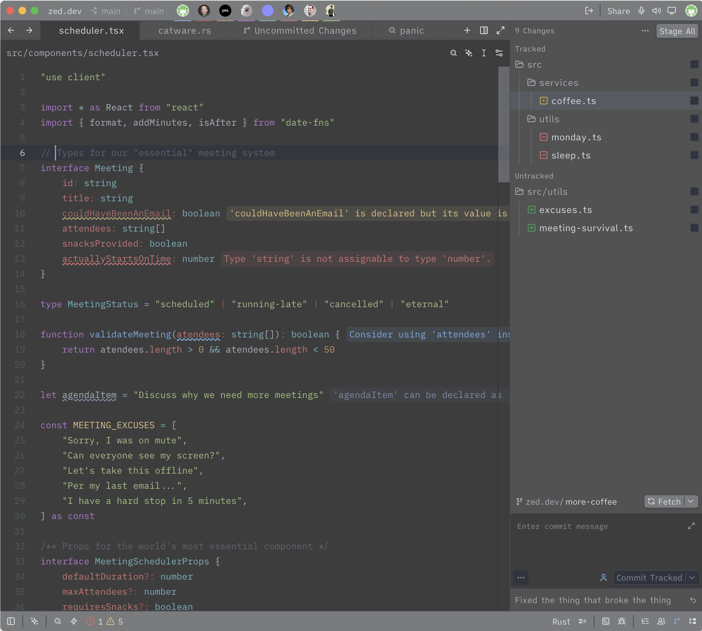

# One Gray

A gray version of Zed's default One theme.

## Installation

1. Copy `gray-one.json` to your Zed themes folder:
   - **macOS/Linux:** `~/.config/zed/themes/`
   - **Windows:** `%APPDATA%\Zed\themes\`
2. Open Zed, press `Cmd/Ctrl + K`, then `T`.
3. Select **Gray One**.

## License

MIT
